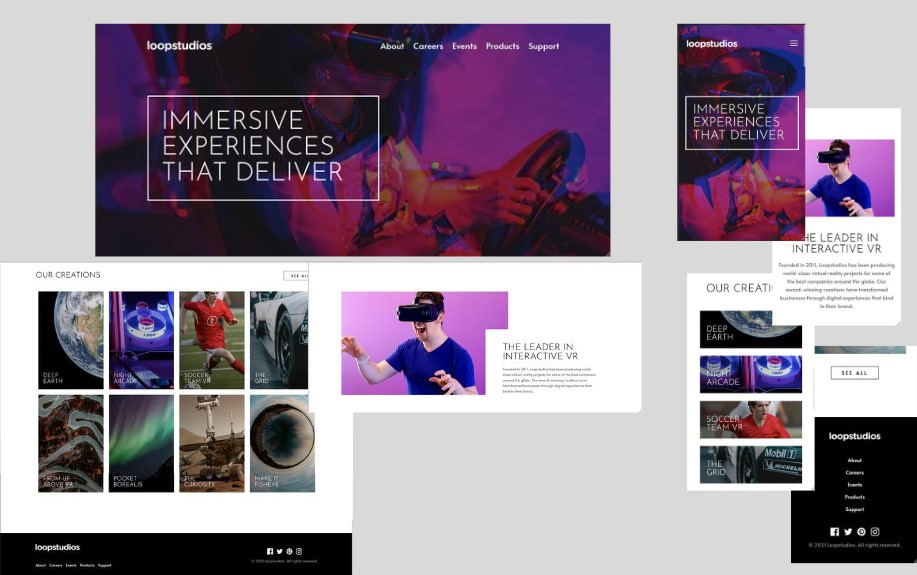

# Frontend Mentor - Loopstudios landing page solution

This is a solution to the [Loopstudios landing page challenge on Frontend Mentor](https://www.frontendmentor.io/challenges/loopstudios-landing-page-N88J5Onjw). Frontend Mentor challenges help you improve your coding skills by building realistic projects.

## Table of contents

- [Overview](#overview)
  - [The challenge](#the-challenge)
  - [Screenshot](#screenshot)
  - [Links](#links)
- [My process](#my-process)
  - [Built with](#built-with)
- [Author](#author)
- [Acknowledgments](#acknowledgments)

**Note: Delete this note and update the table of contents based on what sections you keep.**

## Overview

### The challenge

Users should be able to:

- View the optimal layout for the site depending on their device's screen size
- See hover states for all interactive elements on the page

### Screenshot

### Links

- Solution URL: [Add solution URL here](https://github.com/AndyCatlow/FEMLoopStudio)
- Live Site URL: [Add live site URL here](https://loopstudio-ac.netlify.app)

## My process

### Built with

- Semantic HTML5 markup
- CSS custom properties
- Flexbox
- CSS Grid
- Mobile-first workflow

## Author

- Website - [Andy Catlow](https://www.andycatlow.dev)
- Frontend Mentor - [@AndyCatlow](https://www.frontendmentor.io/profile/AndyCatlow)
- Twitter - [@CatlowAndy](https://www.twitter.com/CatlowAndy)

## Acknowledgments

Thanks to Frontend Mentor for these lovely designs to practice with.
